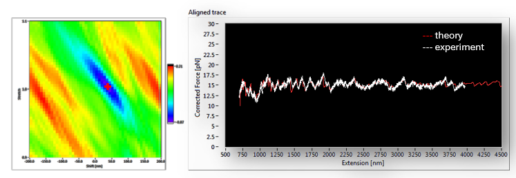

# Trace Alignment By Best Correlation

This project is used to identify the gene from DNA's mechanical unzipping trace.  
To figure out which gene is most likely the DNA we unzipped, we calculate the correlation between the experimental trace and theoreical unzipping traces from all the genes.  

However, the extension we measured in a single-molecule stretching experiment may have errors. The error may from incorrect calibration of camera and piezo stage, or the incorrect starting point of stretching or incorrect trap stiffness. These factors introduces an scaling factor and an offset. We therefore need to align the experimental trace with theoretical traces, then calculate the correlation.  

The practical problem is the surface frastration. A general downhill minimization will almost always be trapped into a local minimum.  

 Calculate the best cross-correlation between experiment and theory for gene identification

In the j-th block, I calculate the 1. maximum correlation, 2. the best scale factor and 3. best offset using an experimental curve and a theoretical unzipping curve of the j-th gene of the whole genome. A whole library of theoretical curves has been established using the [unzip_GPU](https://github.com/Taomihog/unzip_GPU)

