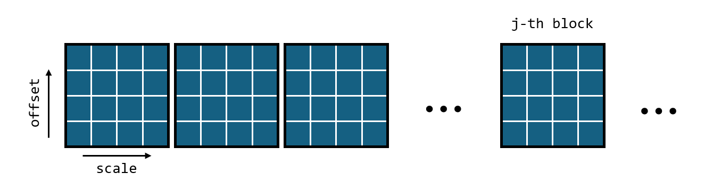

# Gene Identification through Trace Alignment Maximizing Cross-Correlation

**(This project explores the CUDA/GPU's ability to dramatically speed up trace alignment of large scale)** 

This study aims to identify genes from DNA mechanical unzipping traces. Utilizing single-molecule techniques, such as optical tweezers, DNA sequences can be efficiently unzipped with picometer and nanometer precision. Employing high-throughput single-molecule tools to unzip RNA:DNA hybrids prepared from transcripts within single cells offers the potential to obtain transcript profiles from the unzipping traces. To match these traces with their respective genes, experimental traces can be cross-correlated with theoretically predicted traces of all genes, with the unzipping traces most likely originating from genes exhibiting maximum cross-correlation.

In practical applications, measurements of extension in single-molecule stretching experiments may be subject to errors such as inaccurate camera and piezo stage calibration, incorrect starting points for stretching, erroneous trap stiffness values, or inaccurate DNA parameters used for theoretical predictions. These factors can be modeled as an x-axis scaling factor and an x-axis offset. Consequently, aligning the experimental trace with theoretical traces involves adjusting the offset and scaling factor to maximize cross-correlation.

The primary challenge in determining the maximum cross-correlation lies in surface frustration as shown in the figure below. Traditional downhill minimization techniques often become trapped in shallow local minima. To address this, the alignment algorithm employs a brute-force search across a broad area to identify the global minimum, followed by subsequent searches in progressively reduced areas until the minimum is precisely located within a predefined error threshold.

Schematic depiction illustrating the calculation of optimal cross-correlation between experimental and theoretical traces for gene identification:  

Theoretical DNA unzipping traces for all genes can be computed using the [unzipDNA_GPU](https://github.com/Taomihog/unzipDNA_GPU) program.
